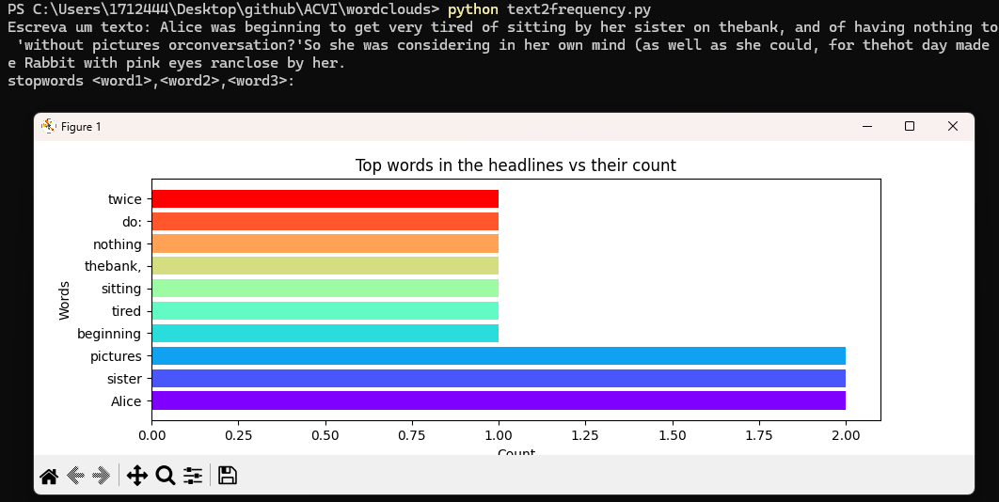
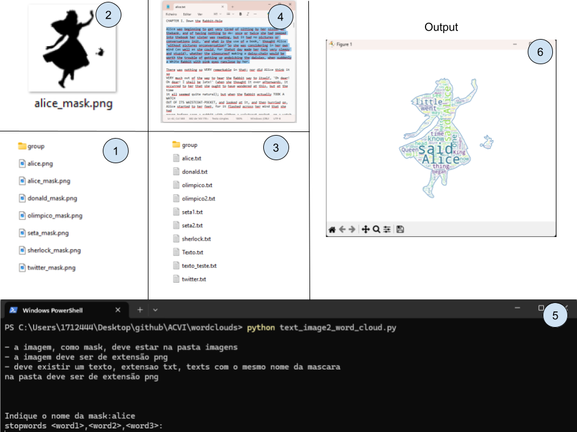
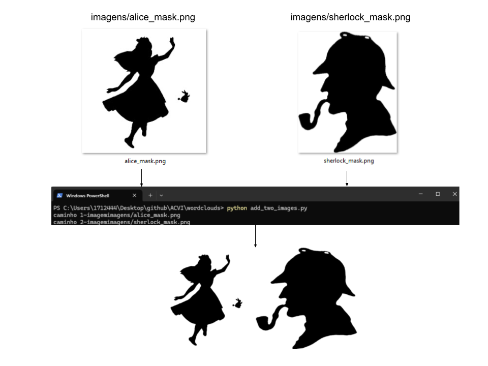

# ACVI

PT: Disciplina sobre Análise, Comunicação e Visualização da Informação

EN: Subject about Analysis, Comunnication and Visualization of Information

# scripts básicos

PT: Scripts básicos em Python

EN: Basic python scripts

# wordclouds

PT: Scripts para trabalhar com wordclouds

EN: Python scripts for wordclouds

## text2frequency.py

## text2word\_cloud.py

## text2word\_cloud\_frequency.py

## text_image2_word_cloud.py
PT: Escolhendo uma imagem como máscara ([image]_mask.png), tomando texto para essa imagem ([image].txt), o script permite ajustar o texto à imagem.

EN: Choose an image as a mask (imagens\[image]_mask.png), the script takes the corresponding text (texts\[image].txt) and inserts it in the image.

## add_two_images.py

PT: Funde duas imagens `<path/img1.png>`, `<path/img2.png>`

EN: Combine two images `<path/img1.png>`, `<path/img2.png>`

